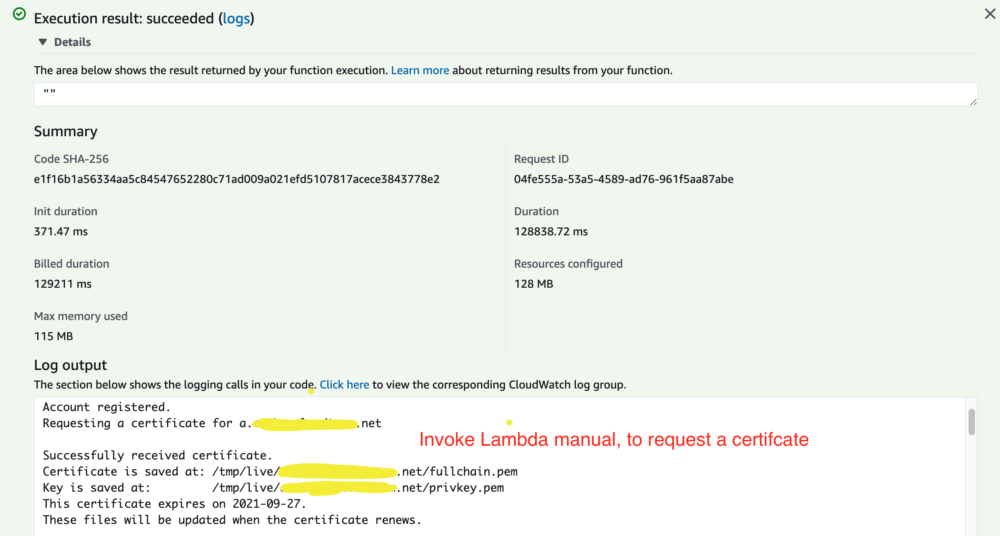
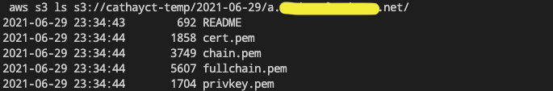

[](https://badge.fury.io/js/cdk-certbot-dns-route53)
[](https://badge.fury.io/py/cdk-certbot-dns-route53)
[](https://github.com/neilkuan/cdk-certbot-dns-route53/actions/workflows/release.yml)

# cdk-certbot-dns-route53 
**cdk-certbot-dns-route53** is a CDK construct library that allows you to create [Certbot](https://github.com/certbot/certbot) Lambda Function on AWS with CDK, and setting schedule cron job to renew certificate to store on S3 Bucket.

## !!! Usage Note !!!
cdk-certbot-dns-route53 before version: `0.3.144`, support aws-cdk version: `1.xxx.xxx`.

cdk-certbot-dns-route53 start at version: `2.x.x`, support aws-cdk version: `2.xxx.xxx`.

```ts
import * as r53 from 'aws-cdk-lib/aws-route53';
import * as s3 from 'aws-cdk-libaws-s3';
import * as cdk from 'aws-cdk-lib';
import { CertbotDnsRoute53Job } from 'cdk-certbot-dns-route53';

const devEnv = {
  account: process.env.CDK_DEFAULT_ACCOUNT,
  region: process.env.CDK_DEFAULT_REGION,
};

const app = new cdk.App();

const stack = new cdk.Stack(app, 'lambda-certbot-dev', { env: devEnv });

new CertbotDnsRoute53Job(stack, 'Demo', {
  certbotOptions: {
    domainName: '*.example.com',
    email: 'user@example.com',
  },
  zone: r53.HostedZone.fromHostedZoneAttributes(stack, 'myZone', {｀
    zoneName: 'example.com',
    hostedZoneId:  'mockId',
  }),
  destinationBucket: s3.Bucket.fromBucketName(stack, 'myBucket', 'mybucket'),
});
```

### Example: Invoke Lambda Function log.


### Example: Renew certificate to store on S3 Bucket

