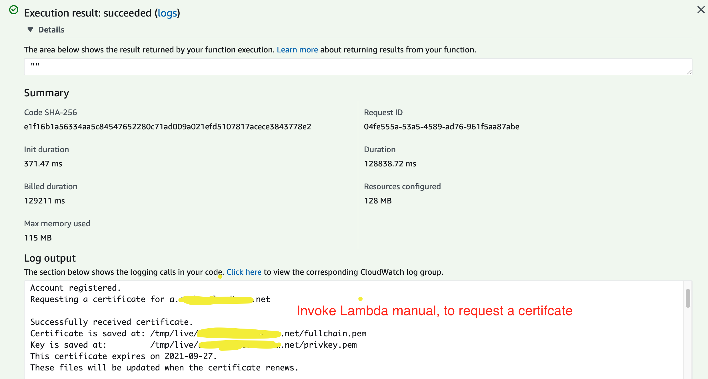
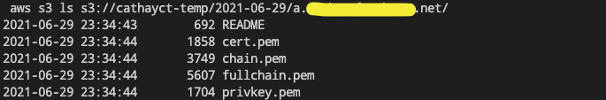

[](https://badge.fury.io/js/cdk-certbot-dns-route53)
[](https://badge.fury.io/py/cdk-certbot-dns-route53)
[](https://github.com/neilkuan/cdk-certbot-dns-route53/actions/workflows/release.yml)


# cdk-certbot-dns-route53 
**cdk-certbot-dns-route53** is a CDK construct library that allows you to create [Certbot](https://github.com/certbot/certbot) Lambda Function on AWS with CDK, and setting schedule cron job to renew certificate to store on S3 Bucket.

## Install
```bash
// for CDKv2
npm install cdk-certbot-dns-route53
or
npm install cdk-certbot-dns-route53@latest
```

### Support Python Lambda Runtime. 2023/12/17
> Support enabled Lambda Function Url.
```ts
import * as r53 from 'aws-cdk-lib/aws-route53';
import * as s3 from 'aws-cdk-lib/aws-s3';
import * as lambda from 'aws-cdk-lib/aws-lambda';
import * as cdk from 'aws-cdk-lib';
import { CertbotDnsRoute53JobPython } from 'cdk-certbot-dns-route53';

const mockApp = new cdk.App();
const stack = new cdk.Stack(mockApp, 'teststack', { env: devEnv });
const bucket = new s3.Bucket(stack, 'testingBucket');
const zone = r53.HostedZone.fromHostedZoneAttributes(stack, 'zone', {
  zoneName: mock.zoneName, hostedZoneId: mock.zoneId,
});
new CertbotDnsRoute53JobPython(stack, 'Testtask', {
  certbotOptions: {
    domainName: 'example.com',
    email: 'user@example.com',
    customPrefixDirectory: '/',
  },
  zone,
  destinationBucket: bucket,
  schedule: events.Schedule.cron({ month: '2' }),
  enabledLambdaFunctionUrl: true,
});

```

### Example: Invoke Lambda Function log.


### Example: Renew certificate to store on S3 Bucket

